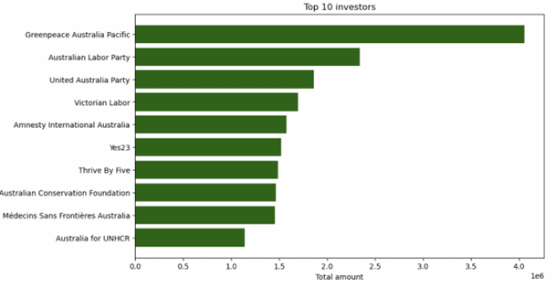
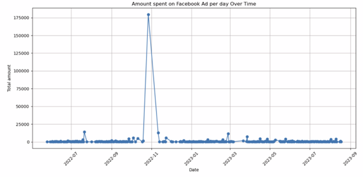
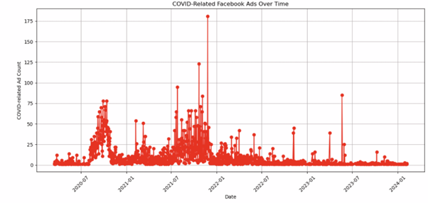
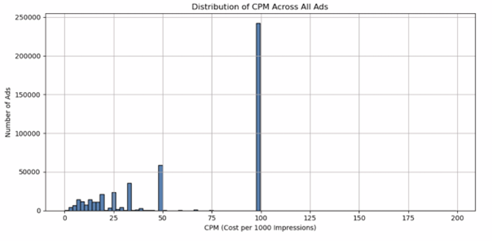

# Facebook Political Advertising Analytics at Scale

## Overview

This project analyzes **political advertising on Facebook in Australia** using **Apache Spark (PySpark)** to process large-scale advertising data from the Facebook Ad Library.

The analysis explores how political organizations use Facebook advertisements by examining:

- Advertisement spending patterns
- Keyword usage in political messaging
- Major funding entities
- Facebook pages running advertisements
- Time-based advertising activity
- COVID-related political campaigns
- Advertisement efficiency using **CPM (Cost per 1000 impressions)**

The project demonstrates how **distributed data processing with PySpark** can be used to analyze large-scale social media advertising datasets.

---

# Dataset

The dataset used in this project is derived from the **Facebook Ad Library political advertising dataset for Australia**.

Due to its large size, the dataset was stored and accessed through the **University High Performance Computing (HPC) environment using HDFS (Hadoop Distributed File System)**.

The data was accessed from:
hdfs:///data/ProjectDatasetFacebookAU/adsAU/*

Because the dataset is hosted within the university infrastructure, it **cannot be redistributed in this repository**.

### Dataset Characteristics

- Large-scale JSON dataset
- Stored in **HDFS**
- Processed using **Apache Spark**
- Contains metadata for Facebook political advertisements

Key fields used in the analysis include:

| Field | Description |
|------|------|
| ad_creation_time | Timestamp when the advertisement was created |
| ad_creative_body / ad_creative_bodies | Text content of the advertisement |
| funding_entity | Organization funding the advertisement |
| page_name | Facebook page running the advertisement |
| spend.upper_bound | Estimated upper bound of advertisement spend |
| impressions.upper_bound | Estimated upper bound of impressions |

# Technology Stack

| Technology | Purpose |
|------|------|
| Apache Spark (PySpark) | Distributed data processing |
| Hadoop HDFS | Large-scale dataset storage |
| Python | Data processing and analytics |
| Pandas | Data transformation for visualization |
| Matplotlib | Visualization |
| Jupyter Notebook | Interactive analysis environment |

# Key Analysis Steps

## Data Cleaning
- Removed advertisements with missing funding entities or page names
- Removed records with missing advertisement text
- Deduplicated advertisements using ad ID

## Text Processing
- Flattened nested advertisement text fields
- Converted advertisement text to lowercase
- Tokenized text into individual words
- Removed common stopwords

## Keyword Analysis
- Computed keyword frequency across advertisements
- Identified keywords associated with the highest advertising spend

## Funding Analysis
- Identified the organizations funding the most Facebook political advertisements
- Analyzed Facebook pages running the largest number of ads

## Time-Based Analysis
- Measured advertisement activity over time
- Calculated daily advertising spending trends

## COVID Campaign Analysis
- Filtered advertisements containing COVID-related messaging
- Analyzed spending and frequency of COVID-related ads

## CPM Analysis

Advertisement efficiency was evaluated using **Cost per 1000 impressions (CPM)**:
CPM = (Ad Spend / Impressions) * 1000

This metric helps evaluate **how efficiently advertising budgets convert into audience reach**.

# Key Visualizations

### Top Political Advertising Funders

This chart shows the organizations that spent the most on Facebook political advertising.

### Advertisement Spending Over Time

Daily advertising spending trends highlight spikes in campaign activity.

### COVID-Related Political Ads Over Time

This visualization tracks the number of advertisements referencing COVID-19.

### Distribution of CPM Across Advertisements

This histogram shows the distribution of advertisement cost efficiency.

# How to Run the Project

## Install Dependencies
pip install -r requirements.txt

## Run the Pipeline
python run_pipeline.py

## Explore the Notebook
notebooks/facebook_ads_analysis.ipynb

# Key Skills Demonstrated

- Distributed data processing using **Apache Spark**
- Large-scale JSON data analysis
- Text analytics and keyword extraction
- Advertisement spending analytics
- Data pipeline structuring
- Data visualization
- Exploratory analysis of social media advertising datasets

# Project Report

The complete methodology and analysis are documented in:
report/project_report.pdf

# Author

**Sowdeshwar Survesha Kumaar**

Master of Data Science  
University of Queensland, Australia 
